<picture><source media="(prefers-color-scheme: dark)" srcset="assets/hero-en-dark.svg"></picture>

<b>English</b> · <a href="README.zh-TW.md">繁體中文</a> · <a href="README.zh-CN.md">简体中文</a> &nbsp;│&nbsp; <a href="https://f0909172434.github.io/?lang=en">Portfolio</a> · <a href="https://f0909172434.github.io/Chih-Kai-Wang-CV.pdf">CV (PDF)</a> · <a href="mailto:f0909172434@gmail.com">Email</a>

## Selected work &nbsp;<code>ls -l --pinned</code>

<a href="https://github.com/f0909172434/honest-ci"><picture><source media="(prefers-color-scheme: dark)" srcset="assets/card-honest-ci-en-dark.svg"></picture></a>
<a href="https://f0909172434.github.io/examples/rigorgraph/math.html"><picture><source media="(prefers-color-scheme: dark)" srcset="assets/card-rigorgraph-en-dark.svg"></picture></a>
<a href="https://f0909172434.github.io/finite-witness-webmcp/"><picture><source media="(prefers-color-scheme: dark)" srcset="assets/card-finite-witness-webmcp-en-dark.svg"></picture></a>
<a href="https://f0909172434.github.io/sair-stage2-proof-press/"><picture><source media="(prefers-color-scheme: dark)" srcset="assets/card-sair-stage2-proof-press-en-dark.svg"></picture></a>
<a href="https://youtu.be/kQH1PZRkn00"><picture><source media="(prefers-color-scheme: dark)" srcset="assets/card-ORACLE-en-dark.svg"></picture></a>
<a href="https://github.com/f0909172434/rulediff-negative-result"><picture><source media="(prefers-color-scheme: dark)" srcset="assets/card-rulediff-negative-result-en-dark.svg"></picture></a>

Each terminal replays a real run against the commit it names; the output is copied, not written.

## Films made as code &nbsp;<code>ckw play --loop *</code>

Three works from October 2026 where the film, the music and the cut are all source code. Each repository documents its pipeline and its limits.

<a href="https://youtu.be/kQH1PZRkn00"><picture><source media="(prefers-color-scheme: dark)" srcset="assets/film-oracle-dark.svg"></picture></a>
<a href="https://youtu.be/ha-ANfqri6g"><picture><source media="(prefers-color-scheme: dark)" srcset="assets/film-disease-dark.svg"></picture></a>
<a href="https://youtu.be/iEsGiRECytY"><picture><source media="(prefers-color-scheme: dark)" srcset="assets/film-world-dark.svg"></picture></a>

- **[卜 ORACLE](https://github.com/f0909172434/ORACLE)** — A 4:30 short film: at 3 a.m. someone asks an AI "Will she get better?" Three.js rendered CPU-only in headless Chromium; score and sound design synthesised in Python. The README cites sources for the film's historical details and marks what was reconstructed. `Three.js r169 · SwiftShader (CPU) · numpy/scipy score` · [▶ Watch](https://youtu.be/kQH1PZRkn00)
- **[病名為AI · The Disease Called AI](https://github.com/f0909172434/The-Disease-Called-AI)** — An original song and hand-painted watercolour music video, 3:35, 67 shots. The score is a Python program; DiffSinger vocals render bit-exactly from fixed seeds; Whisper transcription is used as a diction check. `p5.js + p5.brush · DiffSinger · Kokoro · Whisper QA` · [▶ Watch](https://youtu.be/ha-ANfqri6g)
- **[world.execute(me); · Claude Code](https://github.com/f0909172434/world-execute-me-claude-code)** — Mili's world.execute(me); staged as a Claude Code session and played live in the terminal. Pure Node, no dependencies; every frame is a function of song time. Unofficial fan work after MisakaZentai's DeepSeek Harness version; the song is not included. `Node 20, zero dependencies · 24-bit ANSI · braille/sextant canvases` · [▶ Watch](https://youtu.be/iEsGiRECytY)

## Negative results, kept &nbsp;<code>ckw verify --keep-negatives</code>

Results that did not go the way I hoped stay public, with the same frozen artifacts as the ones that did.

- ✗ **[RuleShift](https://github.com/f0909172434/ruleshift)** — Simple retrieval matched the more complex memory strategies; the complexity did not pay for itself.
- ✗ **[RuleShift-Web](https://github.com/f0909172434/ruleshift-web)** — The no-LLM controller beat both models on the frozen held-out matrix.
- ✗ **[RuleDiff negative result](https://github.com/f0909172434/rulediff-negative-result)** — 0.99 on development, 0.67 held out; the full-paper follow-up was stopped under its preregistered rule and frozen as this report.
- ✗ **[Charlie Alpha 4B](https://github.com/f0909172434/Charlie-Alpha-4B)** — No improvement on P-Bench or StatQA; only the simulator benchmark moved.

## How I work &nbsp;<code>git log --graph</code>

**`01` Frame.** I write the question, the boundary, and what would count as done: which tests, which replay, which hash.

**`02` Execute.** Claude Code and Codex (including Codex Cloud) write most of the code, tests and docs, in branches I review. Most lines in these repositories were typed by an agent; every claim is mine.

**`03` Decide.** Evidence decides, not confidence: tests, independent replay checkers, content hashes. Negative results stay published with the same care as positive ones.

This site and the GitHub profile README are generated from one catalog file; the build fails if they drift.

## Now · Oct 2026 &nbsp;<code>ckw log --now</code>

- Shipped three works made entirely as code: ORACLE, The Disease Called AI, and world.execute(me).
- Froze the RuleDiff negative result as a technical report; the RuleShift-Web manuscript is pre-submission.
- Two upstream fixes merged: DeepSeek Harness Desktop and dsh-engram.
- Learning Lean 4 / Mathlib through ProofWeave and SAIR.

## Merged upstream &nbsp;<code>gh pr list --state merged</code>

- [dsh-tauri/deepseek-harness-desktop#740](https://github.com/dsh-tauri/deepseek-harness-desktop/pull/740) — Normalise symlinked worktree paths so re-creating a worktree cannot misjudge and delete uncommitted changes. 2026-09-26
- [kenz1117/dsh-engram#4](https://github.com/kenz1117/dsh-engram/pull/4) — Trace legacy database claims and add a conservative migration. 2026-09-21
- [EmiyaKatuz/Codex-Dream-Skin-Needy-Girl-Overdose#10](https://github.com/EmiyaKatuz/Codex-Dream-Skin-Needy-Girl-Overdose/pull/10) — Keep Windows verification failures distinguishable: narrower native-window fallback, standalone helper loading. 2026-07-28 · [case study](case-studies/windows-contribution.md)

<b>Everything else</b> — 10 more records

**Tools**

- [Verified Search](https://github.com/f0909172434/dsh-plugin-verified-search) — DeepSeek Harness search plugin that retains citation excerpts and keeps evidence gaps visible. Only verified_search is stable; four extensions are experimental. 250 tests; no independent validation. *v0.1.1 · stable search / experimental extensions*
- [Second Agent Kit](https://github.com/f0909172434/dsh-second-agent-kit) — Patches for DeepSeek Harness on macOS: Seatbelt confinement for shell processes, input-call limits, and per-project memory isolation. Gaps are documented; it is not a universal firewall. *v0.1.4 · macOS only · experimental parts*
- [DSH Architecture Lab](https://github.com/f0909172434/dsh-architecture-lab) — Development-preview toolkit for isolated memory/planning experiments on DeepSeek Harness (Lima VM or Seatbelt), with external judging and cost metering. Results so far come from one small repair task. 85 tests. *v0.1.0-dev.9 · development preview*

**Research**

- [ProofWeave Core](https://github.com/f0909172434/proofweave-math-lab) — Checks author-written structured Markdown proofs against pinned Lean 4 / Mathlib, and reports certification separately from human-confirmed statement alignment. No natural-language translation. *experimental · Core 2*
- [RuleShift](https://github.com/f0909172434/ruleshift) — Deterministic local testbed for how agent memory strategies cope with changing rules. In this pilot, simple retrieval matched more complex strategies (153 / 160) at lower cost. *research pilot · 800 paired tasks*
- [RuleShift-Web](https://github.com/f0909172434/ruleshift-web) — Web-policy memory audit workbench: 3,200 model runs and 1,600 controls. The no-LLM controller was stronger than either model. Draft manuscript, not reviewed. *pre-submission research snapshot*
- [Charlie Alpha 4B](https://github.com/f0909172434/Charlie-Alpha-4B) — Experimental Qwen3.5-4B MLX fine-tune that picks statistical procedures locally. Improves on a simulator benchmark (DGP-Regret −34%) but not on P-Bench or StatQA. *experimental v0.3.0 · mixed results*

**Learning**

- [TokenScope](https://github.com/f0909172434/tokenscope) — Bilingual in-browser lab: a hand-set one-head 5×5 attention toy, sampling controls (temperature, top-k, top-p), a step-by-step BPE merge demo, and exportable numbers. *educational browser lab*
- [MiniHarness](https://github.com/f0909172434/miniharness) — Python workshop where learners build a small agent harness in eight steps, offline with a scripted mock model, backed by a 38-module Traditional Chinese curriculum. Not production. *8-step workshop · zh-TW curriculum*

**Other**

- [DeepSeek Girl](https://github.com/f0909172434/deepseek-girl-codex-pet) — One animation atlas, two unofficial host packages: a 16-direction animated pet for Codex Desktop, and a DeepSeek Harness plugin that reacts to session state, offline. *Codex v0.1.0 · Harness v0.2.0 · unofficial*

<picture><source media="(prefers-color-scheme: dark)" srcset="assets/footer-en-dark.svg"></picture>

Generated from <a href="https://github.com/f0909172434/f0909172434.github.io/blob/main/src/data/projects.json">projects.json</a> by <code>scripts/render-profile.mjs</code>; edits by hand are overwritten. Motion respects <code>prefers-reduced-motion</code>.
