<picture><source media="(prefers-color-scheme: dark)" srcset="assets/hero-zh-CN-dark.svg"></picture>

<a href="README.md">English</a> · <a href="README.zh-TW.md">繁體中文</a> · <b>简体中文</b> &nbsp;│&nbsp; <a href="https://f0909172434.github.io/?lang=zh-Hans">作品集</a> · <a href="https://f0909172434.github.io/Chih-Kai-Wang-CV.pdf">简历 PDF</a> · <a href="mailto:f0909172434@gmail.com">Email</a>

我在国立台北教育大学数学暨资讯教育学系数学组念书，预计 2028 年毕业。做项目时我最喜欢的时刻，是一个说法终于变得「可以检查」：CI 不再只相信绿灯，而是真的去读测试报告；研究的主张被绑到证据的每一个字节；搜索器交出反例时，也告诉你它找过多远。没有成功的想法，我也会留着公开——那也是工作的一部分。

最近在学 Lean 4 和 Mathlib，大多是边做 ProofWeave、边做 SAIR 求解器边学的。我正在找软件或 AI 实习，想加入一个用测试和证据、而不是用信心来决定什么能上线的团队。

## 做过的东西 &nbsp;<code>ls -l --pinned</code>

<a href="https://github.com/f0909172434/honest-ci"><picture><source media="(prefers-color-scheme: dark)" srcset="assets/card-honest-ci-zh-CN-dark.svg"></picture></a>
<a href="https://f0909172434.github.io/examples/rigorgraph/math.html"><picture><source media="(prefers-color-scheme: dark)" srcset="assets/card-rigorgraph-zh-CN-dark.svg"></picture></a>
<a href="https://f0909172434.github.io/finite-witness-webmcp/"><picture><source media="(prefers-color-scheme: dark)" srcset="assets/card-finite-witness-webmcp-zh-CN-dark.svg"></picture></a>
<a href="https://f0909172434.github.io/sair-stage2-proof-press/"><picture><source media="(prefers-color-scheme: dark)" srcset="assets/card-sair-stage2-proof-press-zh-CN-dark.svg"></picture></a>
<a href="https://youtu.be/kQH1PZRkn00"><picture><source media="(prefers-color-scheme: dark)" srcset="assets/card-ORACLE-zh-CN-dark.svg"></picture></a>
<a href="https://github.com/f0909172434/rulediff-negative-result"><picture><source media="(prefers-color-scheme: dark)" srcset="assets/card-rulediff-negative-result-zh-CN-dark.svg"></picture></a>

上面每个终端画面，都是对标示的 commit 真的跑过一次——输出是拷贝下来的，不是写出来的。

## 用程序拍的影片 &nbsp;<code>ckw play --loop *</code>

2026 年 10 月，我做了三件作品：画面、音乐和剪接，全部都是代码。每个仓库都写下了它是怎么做出来的，以及它做不到的地方。

<a href="https://youtu.be/kQH1PZRkn00"><picture><source media="(prefers-color-scheme: dark)" srcset="assets/film-oracle-dark.svg"></picture></a>
<a href="https://youtu.be/ha-ANfqri6g"><picture><source media="(prefers-color-scheme: dark)" srcset="assets/film-disease-dark.svg"></picture></a>
<a href="https://youtu.be/iEsGiRECytY"><picture><source media="(prefers-color-scheme: dark)" srcset="assets/film-world-dark.svg"></picture></a>

- **[卜 ORACLE](https://github.com/f0909172434/ORACLE)** — 一部 4 分 30 秒的短片。凌晨三点，有人问 AI：「她会好起来吗？」画面用 Three.js 在无头 Chromium 里只靠 CPU 渲染，配乐和音效用 Python 合成。片中的史料在 README 注明出处，也标出哪些是重建的。 `Three.js r169 · SwiftShader (CPU) · numpy/scipy score` · [▶ 观看](https://youtu.be/kQH1PZRkn00)
- **[病名为AI · The Disease Called AI](https://github.com/f0909172434/The-Disease-Called-AI)** — 一首原创歌曲和手绘水彩 MV，3 分 35 秒、67 个镜头。乐谱是一支 Python 程序，DiffSinger 的歌声用固定种子逐比特重现，再让 Whisper 听一遍检查咬字。 `p5.js + p5.brush · DiffSinger · Kokoro · Whisper QA` · [▶ 观看](https://youtu.be/ha-ANfqri6g)
- **[world.execute(me); · Claude Code](https://github.com/f0909172434/world-execute-me-claude-code)** — 把 Mili 的 world.execute(me); 演成一场 Claude Code 会话，直接在你的终端里实时播放。纯 Node、零依赖，每一格画面都是歌曲时间的函数。非官方同人作品，承接 MisakaZentai 的 DeepSeek Harness 版本；不含歌曲本身。 `Node 20, zero dependencies · 24-bit ANSI · braille/sextant canvases` · [▶ 观看](https://youtu.be/iEsGiRECytY)

## 没成功的实验 &nbsp;<code>ckw verify --keep-negatives</code>

不是每个实验都会成功。这些是没有照我期待走的结果，一样公开，一样附上冻结的数据。

- ✗ **[RuleShift](https://github.com/f0909172434/ruleshift)** — 最简单的检索就和复杂的记忆策略一样好——多出来的复杂度没有换到成效。
- ✗ **[RuleShift-Web](https://github.com/f0909172434/ruleshift-web)** — 在冻结的保留数据上，不用 LLM 的控制器赢过两个模型。
- ✗ **[RuleDiff negative result](https://github.com/f0909172434/rulediff-negative-result)** — 开发集 0.99、保留集 0.67。依照我事先登记好的规则，完整论文的后续就此停止，冻结成这份报告。
- ✗ **[Charlie Alpha 4B](https://github.com/f0909172434/Charlie-Alpha-4B)** — P-Bench 和 StatQA 没有进步；只有模拟基准有变化。

## 我怎么工作 &nbsp;<code>git log --graph</code>

**`01` 先问清楚。** 动手之前，我先写下：要回答什么问题、范围到哪里、怎样才算完成——要过哪些测试、用什么重播、比对哪个哈希。

**`02` 和 agent 一起做。** 大部分的程序、测试和文档，由 Claude Code 与 Codex（含 Codex Cloud）在我审阅的分支上完成。这里多数的代码是 agent 打的，但每一个主张都由我负责。

**`03` 让证据决定。** 留下什么，由测试、独立重播和内容哈希决定，而不是看我有多有把握。令人失望的结果，也用同样的认真公开。

连这一页也照这个规则：网站和 GitHub 个人页由同一份目录文件产生，两边对不上，构建就不会通过。

## 最近 · 2026 年 10 月 &nbsp;<code>ckw log --now</code>

- 完成三件全部用程序做的作品：卜 ORACLE、病名为AI、world.execute(me)。
- 把 RuleDiff 的负面结果写成一份短的技术报告；RuleShift-Web 的论文还是草稿。
- 两个修正被合并进别人的项目：DeepSeek Harness Desktop 与 dsh-engram。
- 通过 ProofWeave 和 SAIR，一个证明、一个证明地学 Lean 4 与 Mathlib。

## 被合并进别人项目的贡献 &nbsp;<code>gh pr list --state merged</code>

- [dsh-tauri/deepseek-harness-desktop#740](https://github.com/dsh-tauri/deepseek-harness-desktop/pull/740) — 让 worktree 路径先解析符号链接，重建 worktree 时就不会误判、删掉还没提交的修改。 2026-09-26
- [kenz1117/dsh-engram#4](https://github.com/kenz1117/dsh-engram/pull/4) — 追查旧数据库里存放的宣称，加上一个谨慎、保守的迁移。 2026-09-21
- [EmiyaKatuz/Codex-Dream-Skin-Needy-Girl-Overdose#10](https://github.com/EmiyaKatuz/Codex-Dream-Skin-Needy-Girl-Overdose/pull/10) — 让 Windows 上的验证失败分得清楚：缩小原生窗口的降级判断，并修好独立运行时的辅助模块加载。 2026-07-28 · [案例](case-studies/windows-contribution.md)

<b>更多作品</b> — 还有 10 个

**工具**

- [Verified Search](https://github.com/f0909172434/dsh-plugin-verified-search) — DeepSeek Harness 的检索插件：保留它引用的原文段落，也让你看见证据在哪里断掉。只有 verified_search 是稳定版，另外四个扩展仍在实验。250 个测试，尚未经过独立验证。 *v0.1.1 · stable search / experimental extensions*
- [Second Agent Kit](https://github.com/f0909172434/dsh-second-agent-kit) — 让 DeepSeek Harness 在 macOS 上跑得更安全的修补：用 Seatbelt 限制 shell 指令、限制输入调用次数、每个项目的记忆彼此隔离。还有哪些缺口都写清楚了——它不是通用防火墙。 *v0.1.4 · macOS only · experimental parts*
- [DSH Architecture Lab](https://github.com/f0909172434/dsh-architecture-lab) — 开发中的实验室：在隔离环境（Lima VM 或 Seatbelt）里试 DeepSeek Harness 的记忆与规划想法，配上外部评审和费用计量。目前的结果只来自一个小型修复任务。85 个测试。 *v0.1.0-dev.9 · development preview*

**研究**

- [ProofWeave Core](https://github.com/f0909172434/proofweave-math-lab) — 用结构化的 Markdown 写证明，ProofWeave 会拿固定版本的 Lean 4 / Mathlib 来检查。它把两件事分开回报：Lean 有没有认证，以及有没有人确认叙述真的是你想说的。它不做自然语言翻译。 *experimental · Core 2*
- [RuleShift](https://github.com/f0909172434/ruleshift) — 一个小而确定的测试世界，用来问：规则改变时，agent 的记忆撑不撑得住？这次先导实验里，最简单的检索和比较复杂的策略表现相当（153 / 160），成本还更低。 *research pilot · 800 paired tasks*
- [RuleShift-Web](https://github.com/f0909172434/ruleshift-web) — 审核 agent 如何记住网站政策的工作台：3,200 次模型运行，对照 1,600 次控制组。意外的是，完全不用 LLM 的控制器比两个模型都强。论文还是草稿，尚未经过审查。 *pre-submission research snapshot*
- [Charlie Alpha 4B](https://github.com/f0909172434/Charlie-Alpha-4B) — 实验性的 4B 模型（Qwen3.5，用 MLX 微调），在本机建议该用哪种统计方法。它在模拟基准上进步了（DGP-Regret −34%），但在 P-Bench 和 StatQA 上没有。 *experimental v0.3.0 · mixed results*

**学习**

- [TokenScope](https://github.com/f0909172434/tokenscope) — 一个看进语言模型内部的双语游乐场：手动设置的单头 5×5 注意力玩具、采样旋钮（temperature、top-k、top-p），以及一步一步的 BPE 合并。每个数字都能导出。 *educational browser lab*
- [MiniHarness](https://github.com/f0909172434/miniharness) — Python 工作坊：分八步亲手做出一个小型 agent harness，全程离线、搭配脚本化的模拟模型，附 38 个单元的繁体中文课程。用来学习，不是上线用的。 *8-step workshop · zh-TW curriculum*

**其他**

- [DeepSeek Girl](https://github.com/f0909172434/deepseek-girl-codex-pet) — 同一套动画、两个非官方的家：Codex Desktop 上会朝 16 个方向看的动画宠物，以及会随 Session 状态反应的 DeepSeek Harness 插件。离线运作。 *Codex v0.1.0 · Harness v0.2.0 · unofficial*

<picture><source media="(prefers-color-scheme: dark)" srcset="assets/footer-zh-CN-dark.svg"></picture>

由 <a href="https://github.com/f0909172434/f0909172434.github.io/blob/main/src/data/projects.json">projects.json</a> 经 <code>scripts/render-profile.mjs</code> 产生；手动修改会被覆盖。动画会遵守 <code>prefers-reduced-motion</code>。
