<picture><source media="(prefers-color-scheme: dark)" srcset="assets/hero-zh-TW-dark.svg"></picture>

<a href="README.md">English</a> · <b>繁體中文</b> · <a href="README.zh-CN.md">简体中文</a> &nbsp;│&nbsp; <a href="https://f0909172434.github.io/?lang=zh-Hant">作品集</a> · <a href="https://f0909172434.github.io/Chih-Kai-Wang-CV.pdf">履歷 PDF</a> · <a href="mailto:f0909172434@gmail.com">Email</a>

## 精選作品 &nbsp;<code>ls -l --pinned</code>

<a href="https://github.com/f0909172434/honest-ci"><picture><source media="(prefers-color-scheme: dark)" srcset="assets/card-honest-ci-zh-TW-dark.svg"></picture></a>
<a href="https://f0909172434.github.io/examples/rigorgraph/math.html"><picture><source media="(prefers-color-scheme: dark)" srcset="assets/card-rigorgraph-zh-TW-dark.svg"></picture></a>
<a href="https://f0909172434.github.io/finite-witness-webmcp/"><picture><source media="(prefers-color-scheme: dark)" srcset="assets/card-finite-witness-webmcp-zh-TW-dark.svg"></picture></a>
<a href="https://f0909172434.github.io/sair-stage2-proof-press/"><picture><source media="(prefers-color-scheme: dark)" srcset="assets/card-sair-stage2-proof-press-zh-TW-dark.svg"></picture></a>
<a href="https://youtu.be/kQH1PZRkn00"><picture><source media="(prefers-color-scheme: dark)" srcset="assets/card-ORACLE-zh-TW-dark.svg"></picture></a>
<a href="https://github.com/f0909172434/rulediff-negative-result"><picture><source media="(prefers-color-scheme: dark)" srcset="assets/card-rulediff-negative-result-zh-TW-dark.svg"></picture></a>

每個終端機畫面都重播一次對指定 commit 的真實執行；輸出是複製的，不是寫出來的。

## 以程式完成的影片 &nbsp;<code>ckw play --loop *</code>

2026 年 10 月的三件作品：畫面、音樂與剪接全部是原始碼。每個倉庫都記錄了流程與限制。

<a href="https://youtu.be/kQH1PZRkn00"><picture><source media="(prefers-color-scheme: dark)" srcset="assets/film-oracle-dark.svg"></picture></a>
<a href="https://youtu.be/ha-ANfqri6g"><picture><source media="(prefers-color-scheme: dark)" srcset="assets/film-disease-dark.svg"></picture></a>
<a href="https://youtu.be/iEsGiRECytY"><picture><source media="(prefers-color-scheme: dark)" srcset="assets/film-world-dark.svg"></picture></a>

- **[卜 ORACLE](https://github.com/f0909172434/ORACLE)** — 4 分 30 秒短片：凌晨三點，有人問 AI「她會好起來嗎？」Three.js 在無頭 Chromium 裡只用 CPU 渲染，配樂與音效用 Python 合成。README 為片中的史料註明出處，並標示哪些是重建。 `Three.js r169 · SwiftShader (CPU) · numpy/scipy score` · [▶ 觀看](https://youtu.be/kQH1PZRkn00)
- **[病名為AI · The Disease Called AI](https://github.com/f0909172434/The-Disease-Called-AI)** — 原創歌曲與手繪水彩 MV，3 分 35 秒，67 個鏡頭。樂譜是一支 Python 程式；DiffSinger 歌聲用固定種子逐位元重現；用 Whisper 聽寫檢查咬字。 `p5.js + p5.brush · DiffSinger · Kokoro · Whisper QA` · [▶ 觀看](https://youtu.be/ha-ANfqri6g)
- **[world.execute(me); · Claude Code](https://github.com/f0909172434/world-execute-me-claude-code)** — 把 Mili 的 world.execute(me); 演成一場 Claude Code 會話，直接在終端機裡即時播放。純 Node、零依賴；每一格畫面都是歌曲時間的函數。非官方同人作品，承接 MisakaZentai 的 DeepSeek Harness 版；不含歌曲音檔。 `Node 20, zero dependencies · 24-bit ANSI · braille/sextant canvases` · [▶ 觀看](https://youtu.be/iEsGiRECytY)

## 留下來的負面結果 &nbsp;<code>ckw verify --keep-negatives</code>

沒有照期望走的結果也公開，和成功的結果一樣附上凍結的產物。

- ✗ **[RuleShift](https://github.com/f0909172434/ruleshift)** — 簡單檢索與較複雜的記憶策略表現相當；複雜度沒有換到成效。
- ✗ **[RuleShift-Web](https://github.com/f0909172434/ruleshift-web)** — 在凍結的保留矩陣上，不用 LLM 的控制器勝過兩個模型。
- ✗ **[RuleDiff negative result](https://github.com/f0909172434/rulediff-negative-result)** — 開發集 0.99、保留集 0.67；完整論文的後續依預先登錄的規則停止，凍結成這份報告。
- ✗ **[Charlie Alpha 4B](https://github.com/f0909172434/Charlie-Alpha-4B)** — P-Bench 與 StatQA 沒有改善；只有模擬基準有變化。

## 我怎麼工作 &nbsp;<code>git log --graph</code>

**`01` 設定框架。** 我寫下問題、邊界，以及什麼才算完成：哪些測試、哪個重播、哪個雜湊。

**`02` 執行。** Claude Code 與 Codex（含 Codex Cloud）在我審閱的分支上寫大部分的程式、測試與文件。這些倉庫裡大多數的行是 agent 打出來的；每一個主張都由我負責。

**`03` 決定。** 由證據決定，不由信心決定：測試、獨立的重播檢查器、內容雜湊。負面結果和正面結果一樣，用同樣的標準留下來。

這個網站與 GitHub 個人頁 README 由同一份目錄檔產生；兩者不一致時，建置會失敗。

## 近況 · 2026 年 10 月 &nbsp;<code>ckw log --now</code>

- 發布三件全部以程式完成的作品：卜 ORACLE、病名為AI、world.execute(me)。
- 把 RuleDiff 的負面結果凍結成技術報告；RuleShift-Web 的論文仍在投稿前。
- 兩個上游修正已合併：DeepSeek Harness Desktop 與 dsh-engram。
- 透過 ProofWeave 與 SAIR 學 Lean 4 / Mathlib。

## 已合併的上游貢獻 &nbsp;<code>gh pr list --state merged</code>

- [dsh-tauri/deepseek-harness-desktop#740](https://github.com/dsh-tauri/deepseek-harness-desktop/pull/740) — 規範化符號連結的 worktree 路徑，避免重建 worktree 時誤判並刪除未提交的修改。 2026-09-26
- [kenz1117/dsh-engram#4](https://github.com/kenz1117/dsh-engram/pull/4) — 追溯舊資料庫的宣稱，加入保守的遷移。 2026-09-21
- [EmiyaKatuz/Codex-Dream-Skin-Needy-Girl-Overdose#10](https://github.com/EmiyaKatuz/Codex-Dream-Skin-Needy-Girl-Overdose/pull/10) — 讓 Windows 驗證失敗可區分：縮小原生視窗的降級判斷，修正獨立執行時的輔助模組載入。 2026-07-28 · [案例](case-studies/windows-contribution.md)

<b>其他作品</b> — 還有 10 筆記錄

**工具**

- [Verified Search](https://github.com/f0909172434/dsh-plugin-verified-search) — DeepSeek Harness 檢索外掛：保留引用片段，讓證據缺口可見。只有 verified_search 是穩定版，四個擴充工具仍屬實驗。250 個測試；尚無獨立驗證。 *v0.1.1 · stable search / experimental extensions*
- [Second Agent Kit](https://github.com/f0909172434/dsh-second-agent-kit) — DeepSeek Harness 的 macOS 修補：shell 程序的 Seatbelt 限制、輸入呼叫上限、以專案為單位的記憶隔離。缺口都有記錄；它不是萬用防火牆。 *v0.1.4 · macOS only · experimental parts*
- [DSH Architecture Lab](https://github.com/f0909172434/dsh-architecture-lab) — 開發預覽：在 DeepSeek Harness 上跑隔離的記憶／規劃實驗（Lima VM 或 Seatbelt），附外部評判與費用計量。目前的結果只來自一個小型修復任務。85 個測試。 *v0.1.0-dev.9 · development preview*

**研究**

- [ProofWeave Core](https://github.com/f0909172434/proofweave-math-lab) — 把作者手寫的結構化 Markdown 證明交給固定版本的 Lean 4 / Mathlib 檢查，並把「已認證」與「人工確認語意對齊」分開回報。不做自然語言翻譯。 *experimental · Core 2*
- [RuleShift](https://github.com/f0909172434/ruleshift) — 確定性的本機測試床，看 agent 記憶策略如何面對規則改變。這次先導實驗裡，簡單檢索與較複雜的策略表現相當（153 / 160），成本更低。 *research pilot · 800 paired tasks*
- [RuleShift-Web](https://github.com/f0909172434/ruleshift-web) — Web 政策記憶稽核工作台：3,200 次模型執行與 1,600 次對照。不用 LLM 的控制器比兩個模型都強。草稿論文，未經審查。 *pre-submission research snapshot*
- [Charlie Alpha 4B](https://github.com/f0909172434/Charlie-Alpha-4B) — 實驗性的 Qwen3.5-4B MLX 微調，在本機挑選統計程序。在模擬基準有改善（DGP-Regret −34%），在 P-Bench 與 StatQA 沒有。 *experimental v0.3.0 · mixed results*

**學習**

- [TokenScope](https://github.com/f0909172434/tokenscope) — 雙語瀏覽器實驗室：手動設定的單頭 5×5 注意力玩具、取樣控制（temperature、top-k、top-p）、逐步 BPE 合併示範，數值可匯出。 *educational browser lab*
- [MiniHarness](https://github.com/f0909172434/miniharness) — Python 工作坊：八步做出一個小型 agent harness，離線使用腳本化的模擬模型，附 38 個模組的繁體中文課程。不是生產環境用的。 *8-step workshop · zh-TW curriculum*

**其他**

- [DeepSeek Girl](https://github.com/f0909172434/deepseek-girl-codex-pet) — 同一份動畫圖集、兩個非官方宿主套件：Codex Desktop 的 16 方向動畫寵物，以及回應 Session 狀態的 DeepSeek Harness 外掛，離線運作。 *Codex v0.1.0 · Harness v0.2.0 · unofficial*

<picture><source media="(prefers-color-scheme: dark)" srcset="assets/footer-zh-TW-dark.svg"></picture>

由 <a href="https://github.com/f0909172434/f0909172434.github.io/blob/main/src/data/projects.json">projects.json</a> 經 <code>scripts/render-profile.mjs</code> 產生；手動修改會被覆蓋。動畫會遵守 <code>prefers-reduced-motion</code>。
